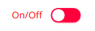
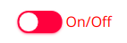

[](https://www.webcomponents.org/element/jelly-switch) 


# jelly-switch
A simple, customizable and jellified switch built as web component using ES6 javascript 

### NOTE: This component is still in work in progress *WIP*. So there is a high chance that the API can change. So please be notified


This micro web component(~1.7kB) can be used for any framework

# Try Now
Play with the component
[](https://codesandbox.io/s/ryl1qzxn0m)

# Install
### 1. via npm
```
npm i jelly-switch
```
(or)
### 2.via script tag

```html
<script src ="https://unpkg.com/jelly-switch@0.2.1/lib/index.min.js"></script>
```

# Usage

### 1.Import into module script(required only for npm install):

```javascript
import { JellySwitch } from "jelly-switch"
```
### 2.Use it in your web page like any other HTML element
```html
<jelly-switch id="js1"></jelly-switch>
```

### 3. Like any other input type, label can be used to bind with the jelly-switch element using 'slot' attribute as shown below. For more information on this,  refer the [Slots](#Slots) sub section in [API](#API) section
```html
<jelly-switch id="js1">
    <p slot="content-left">On/Off</p>
</jelly-switch>
```

# API

## Attributes

- `checked`

 Add this attribute to set the switch to toggled / checked mode i.e., equivalent to 'checked' attribute of input type 
 ```html
  <jelly-switch id="js1" checked></jellyswitch>
  ```
  (or)
 ```javascript
js1.checked = true
``` 
- `disabled`

Add this attribute to disable the switch and the opacity will be decreased to half and user can not interact with the switch and cursor will be changed to 'not-allowed'
```html
<jelly-switch id ="js1" disabled></jellyswitch>

```
(or)
```javascript
js1.disabled = true;
```
## Slots
- For achieving the `label` binding with the `input` by `for` attribute, `slot` feature has been used in this custom element
- For label to position to left of the `jelly-switch` , slot attribute with the value `content-left` can be used for any other native HTML Element as shown in the example below
```html
<jelly-switch>
    <p slot="content-left">On/Off</p>
</jelly-switch>
```
- For label to position to right of the `jelly-switch` , slot attribute with the value `content-right` can be used for any other native HTML Element as shown below
```html
<jelly-switch>
    <p slot="content-right">On/Off</p>
</jelly-switch>
```
| Slot name | Description | Image |
|-----------|-------------|-------|
|`content-left`| This would render the label to left of the switch ||
|`content-right`| This would render the label to right of the switch |

## Styling

The switch component can be styled as a normal and regular HTML element in CSS. There are list of CSS properties below with the default values

| CSS variables | Default value | Description |
|---------------|---------------|-------------|
|`--off-color ` | #FF4651       | background color of switch when the switch is off or its value is set to false. Can assign any color to rgba, hex values |
|`--on-color ` | #11C75D       | background color of switch when the switch is on or its value is set to true. Can assign any color to rgba, hex values |
|`--onHandle-color ` | #FFFFFF      |  color of switch Handle when the switch is on or its value is set to true. Can assign any color to rgba, hex values |
|`--offHandle-color ` | #FFFFFF     |  color of switch Handle when the switch is off or its value is set to false. Can assign any color to rgba, hex values |

The CSS variables can be set dynamically. For example, refer the following snippet
```javascript
document.documentElement.style.setProperty('--off-color', 'rgba(25,89,79,0.7');
```
## Events

- `toggle`

    - The toggle event is triggered when the user toggles the switches either by
       -  clicking on the switch (or)
       -  pressing `space` on the keyboard when the switch is focused
    - The present value can be accessed from `event.detail.value` as shown in the below example


```javascript
document.documentElement.addEventListener('toggle',handleToggle(e));
```
or

```html
<jelly-switch onToggle="return handleToggle(e)"></jelly-switch>
```
and value can be obtained as follows

```javascript
function handleToggle(e)
{
    //The value after the user toggles the switch can be accessed from the below code
    console.log('The present value of switch is '+e.detail.value);
    //here e is the event object 
}
```

# Accessibility
- ARIA has been handled


# ToDos
 - [x] Handle keyboard `space` event
 - [x] Add box-shadow to focus 
 - [x] Accessibility check
 - [x] Basic Unit testing 
 - [x] Lazy property handling
 - [x] Documentation
 - [x] npm publish
 - [x] Add label 'for' support 
 - [x] Minify js file
 - [ ] Writing the release notes (changeLog.md file)
 - [ ] Adding unit test cases
 - [ ] Write contribute.md file
 - [ ] handling drag event

# License
[MIT License](https://github.com/akhil0001/jellySwitch/blob/master/LICENSE) (c) [Akhil Sai](https://codepen.io/akhil_001/)

Made with ❤️ by Akhil 
